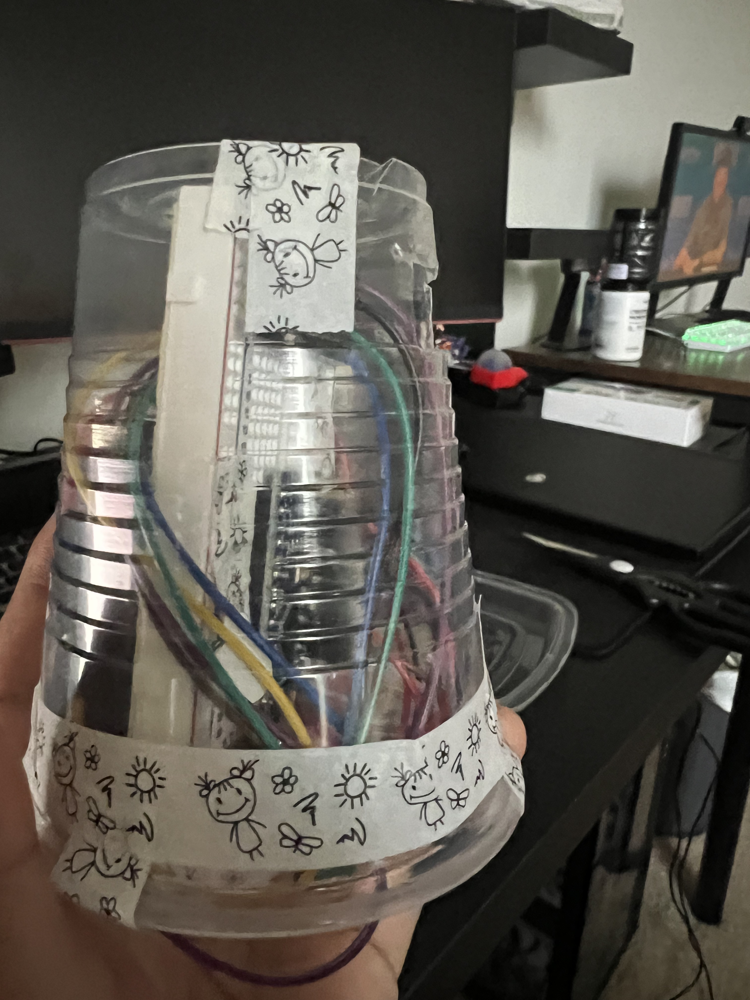
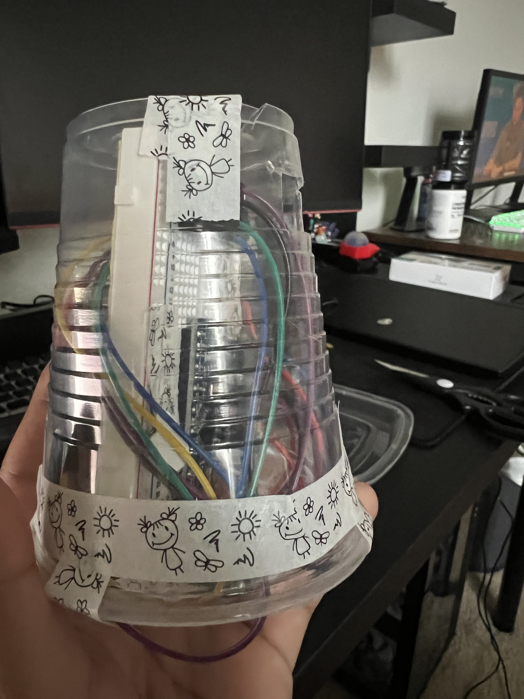
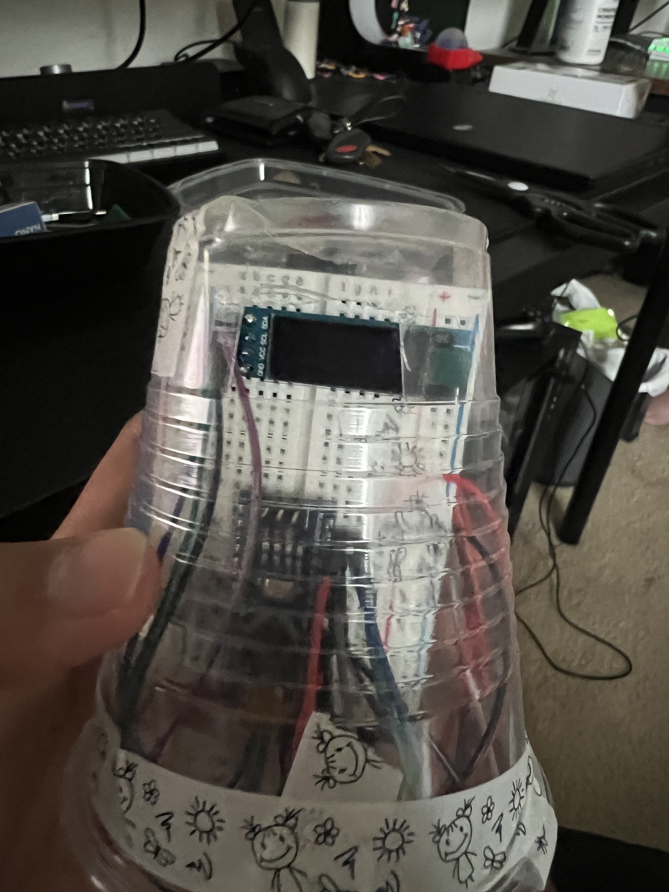
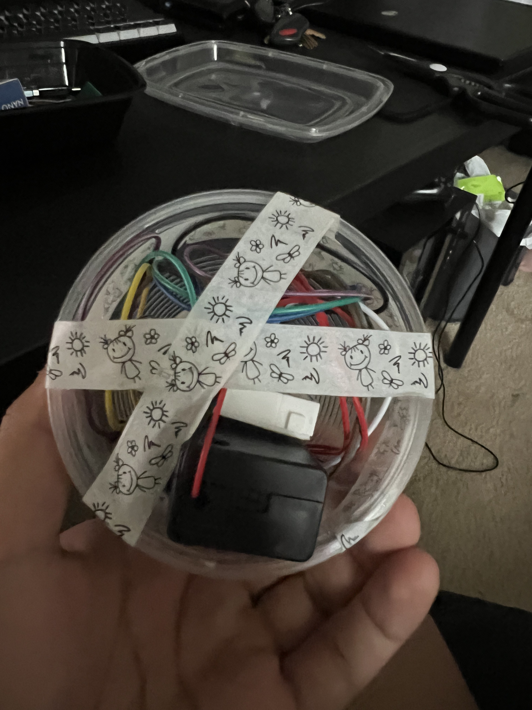

# Venz Burgos Report

Prepared by Venz Burgos
Date: 04/17/2023

## Gesture Detection Cup

In Gesture Detection, I didn't have nay issues with gesture detection because I was able to adjust sensitivity of my gesture detection. My accelerometer is at the top and the buzzer is on the wall of the cup.
